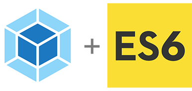

# ECMAScript 6

## Webpack 4

* [Getting Started](https://webpack.js.org/guides/getting-started/)
* [Output Management](https://webpack.js.org/guides/output-management/)
* [Development](https://webpack.js.org/guides/development/)
* [Webpack plugin for Babel](https://github.com/babel/babel-loader)
* [HTML Webpack Plugin](https://github.com/jantimon/html-webpack-plugin)
* [How to add wildcard mapping in entry of webpack](https://stackoverflow.com/questions/32874025/how-to-add-wildcard-mapping-in-entry-of-webpack)

## Document

* [Learn ES2015](https://babeljs.io/docs/en/learn)
* [ECMAScript 6 — New Features: Overview & Comparison](http://es6-features.org/)
* [ECMAScript 6 Cheatsheet](http://help.wtf/es6)
* [Minimalist examples of ES6 functionalities.](https://github.com/hemanth/paws-on-es6)
* [Understanding ECMAScript 6](https://leanpub.com/understandinges6/read/)
* [Exploring ES6](http://exploringjs.com/es6/)

## Reference

* [&#40;자알쓰&#41; 값&#40;Value&#41; vs 식&#40;Expression&#41; vs 문&#40;Statement&#41;](https://blog.perfectacle.com/2017/06/02/js-007-value-expression-statement/)
* [google-webfonts-helper](https://google-webfonts-helper.herokuapp.com/fonts)
